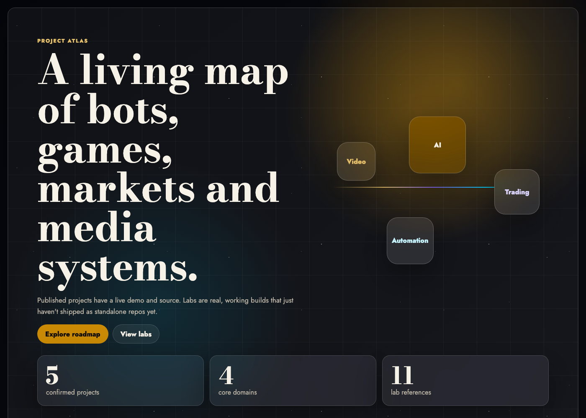

# Project Atlas


**[▶ Live site](https://detemen.github.io/project-roadmap-site/)**



An interactive roadmap/dashboard that visualizes a personal portfolio of projects — filterable by domain, stage and tech stack, with a "constellation" view of how projects relate to each other.

## Features

- **Filterable grid** — narrow projects by domain (Video, Trading, Social Automation, AI Systems, Games, Labs…), stage (Research → Production) or stack.
- **Roadmap constellation** — a visual map of project relationships.
- **Project dossier** — click a project for details: role, stack, stage and related projects.
- **Stats overview** — live counts as filters change.

## Stack

React 19 + TypeScript, Vite, Vitest + Testing Library for unit tests.

## Development

```bash
npm install
npm run dev       # start dev server
npm test          # run unit tests
npm run build     # type-check + production build
```

## Project structure

```
src/
├── data/projects.ts          # project catalog (data source)
├── lib/projectFilters.ts     # filtering/stats logic (unit tested)
└── components/
    ├── ProjectAtlasHero.tsx
    ├── FilterBar.tsx
    ├── ProjectGrid.tsx
    ├── RoadmapConstellation.tsx
    ├── ProjectDossier.tsx
    ├── ProjectStats.tsx
    └── LabsReferences.tsx
```
